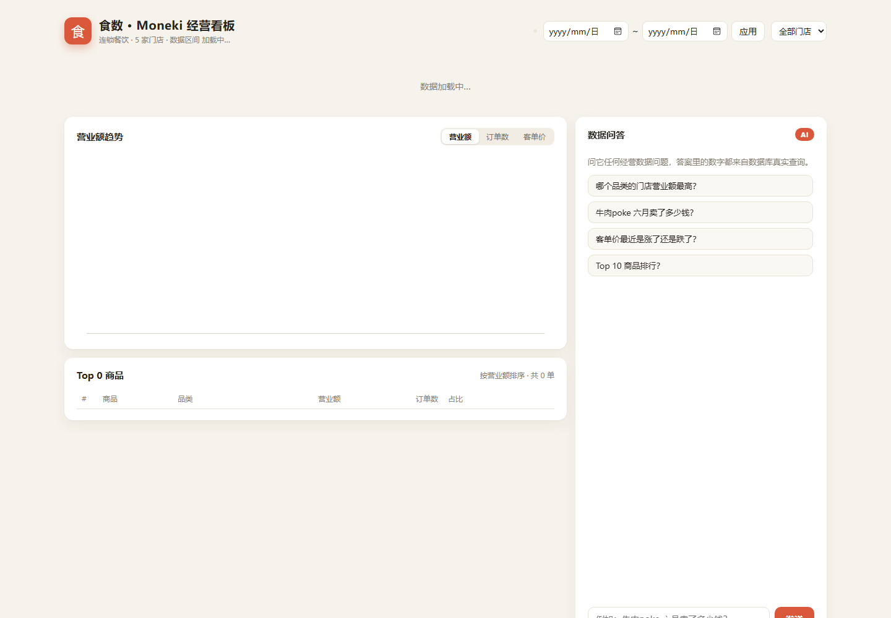

# DEMO.md — 演示脚本与数字可信性说明

## 如何复现

```bash
npm install
npm run seed
npm run dev
```

打开 http://localhost:5173，右侧「数据问答」面板即可提问。

## 演示的 3 个问题（来自作业要求）

### Q1：哪个品类的门店营业额最高？

> 2026-05-01 至 2026-07-31 各门店营业额：
> 1. Super Tetsudo（日料，上海·黄浦）¥88,718.00，2,423 单，占比 20.87%
> ……
> 营业额最高的是 Super Tetsudo（日料），¥88,718.00。

**为什么可信**：这是 `revenueByStore` 工具执行的真实 SQL——`sales JOIN stores GROUP BY store_id` 的结果，答案里的 ¥88,718.00 与第一关 `/api/stores` 接口返回值一致，评审可直接对照。

### Q2：牛肉poke 六月卖了多少钱？

> 牛肉poke 在 2026-06-01 至 2026-06-30 卖出 ¥13,524.00（182 单，322 件）。

**为什么可信**：`productSales` 工具执行 `sales JOIN products WHERE product_id='P06' AND date BETWEEN …`，¥13,524.00 即数据库真实求和；接口源码在 `server/queries.js`，测试 `tests/ai.test.js` 断言了该数字与直连 SQL 相等。

### Q3：客单价最近是涨了还是跌了？

> 客单价对比：2026-06-01 至 2026-06-30 为 ¥35.18，2026-07-01 至 2026-07-31 为 ¥36.05，涨了（+2.47%）。

**为什么可信**：`aovTrend` 用 SQL 分别计算两个自然月的 `SUM(amount)/COUNT(*)`，涨跌方向与两个数字全部来自查询结果；与 `/api/overview?from=2026-06-01&to=2026-06-30`（客单价 35.18）和 7 月区间（36.05）一致。

## 加分演示：追问与图表联动

- 追问「那五月呢？」：继承上一轮商品 P06，自动查询 5 月 →「牛肉poke 在 2026-05-01 至 2026-05-31 卖出 ¥13,104.00（190 单，312 件）」。
- 每次 AI 回答后，前端自动应用 `chartState`：趋势图跳转到对应日期区间，门店/商品面板高亮对应实体，消息下方显示「✓ 已联动图表」与来源标签（工具名、行数、耗时）。

## 兜底演示（不编造）

- 问「今天天气怎么样？」→「这个问题我答不了。我只能回答这份销售数据相关的问题……」
- 问「奶茶 六月卖了多少钱？」→「数据中没有找到「奶茶」相关的销售记录。」
- 问「poke 六月卖了多少钱？」→「数据里有多个商品包含你提到的名字：三文鱼poke、鸡肉poke、牛肉poke。请说得更具体些。」

## 界面截图



## 数字可信性总结

1. AI 只负责把问题翻译成工具调用，**数字不经过模型改写**（确定性模板渲染）；
2. 每次回答都附带 `source`（工具 + 行数 + 耗时），前端展示「数据来源」；
3. `npm test` 中 23 个用例里包含一组真值断言：AI 回答的关键数字与直接 SQL 结果逐位相等。
